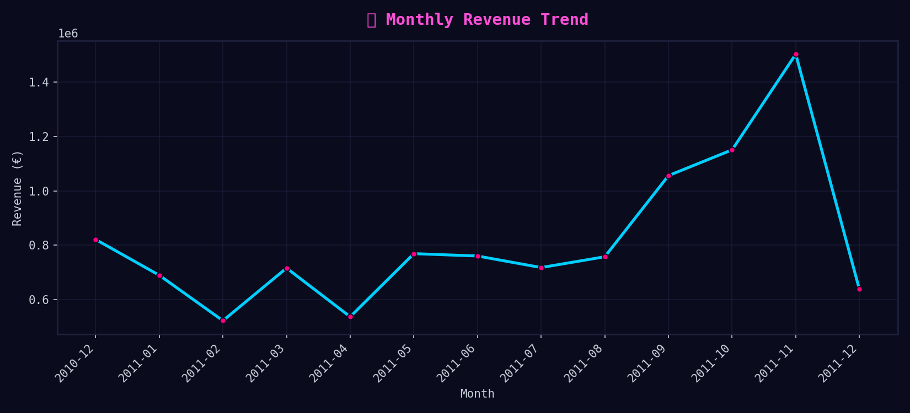
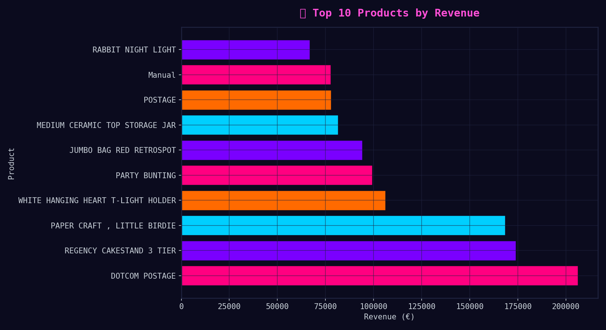
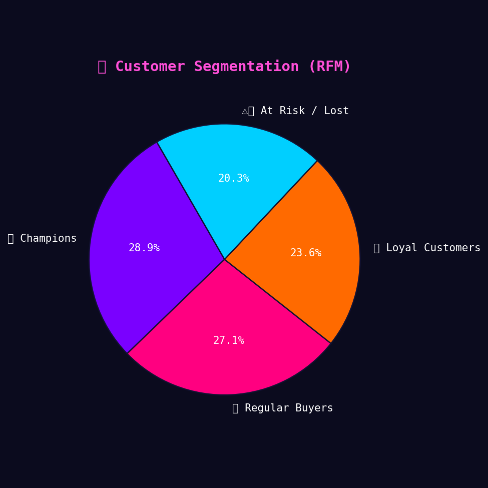

  

<h1 align="center">🧾 E-commerce & Finance Analytics Portfolio</h1>

  <em>SQL-driven data cleaning and analysis uncovering revenue trends, product performance, and seasonal insights from 500K+ e-commerce transactions.</em>

---

# 🧾 Ecommerce & Finance Analytics Portfolio  

> **End-to-end Data Analytics Project** — from raw retail data to actionable business insights using **SQL + Python + Cyberpunk Visualization**.  
> Cleaned, analyzed, and visualized **500K+ transactions** to uncover patterns in revenue, products, and customer behavior.  

---

## 📖 Project Overview  
This project demonstrates a complete **data cleaning and analytics workflow** using **SQL (MySQL)** and **Python (Pandas, Matplotlib)** on a real-world **E-Commerce and Finance dataset**.  
It contains 500K+ retail transactions from a UK-based online retailer between 2010–2011.  

The goal was to transform raw data into **business intelligence** — revealing insights into revenue growth, top-performing products, and customer segmentation.  

---

## ⚙️ Tech Stack  
- 🧮 **SQL (MySQL)** — Data cleaning, transformation, KPI computation  
- 🐍 **Python (Pandas, Matplotlib)** — Data analysis & Cyberpunk visualizations  
- 📊 **Excel / CSV** — Data validation and exports  
- 💾 **GitHub** — Version control and project documentation  
- *(Next Phase: Tableau / Power BI dashboards)*  

---

## 🧹 Data Cleaning Workflow  

**Source:** [Kaggle – E-Commerce Data (Carrie1)](https://www.kaggle.com/datasets/carrie1/ecommerce-data)

### Cleaning Steps  
1. **Imported raw data (541,909 rows)** via `LOAD DATA INFILE`.  
2. **Converted string to datetime** using `STR_TO_DATE`.  
3. **Handled missing and anomalous data:**  
   - Fixed date parsing  
   - Found 2,521 zero-price & 2 negative-price rows  
4. **Removed duplicates** using `ROW_NUMBER()` window function.  
5. **Filtered invalid records** (Quantity ≠ 0, UnitPrice > 0).  
6. **Created new analytical fields:**  
   - `LineAmount = Quantity × UnitPrice`  
   - `IsReturn` flag for negative quantities  
   - `InvoiceYear`, `InvoiceMonth`, `InvoiceHour`  
7. **Built indexes** for faster querying (`date`, `customer`, `stock`).  
8. Final **cleaned dataset:** **534,123 valid transactions**.

---

## 💰 Key Insights  

### **1️⃣ Gross Revenue**
**€10,641,558.95** from 534K valid transactions  

---

### **2️⃣ Top 10 Products by Revenue**
| Rank | Product | Revenue (€) |
|------|----------|-------------|
| 1 | DOTCOM POSTAGE | 206,248.77 |
| 2 | REGENCY CAKESTAND 3 TIER | 174,156.54 |
| 3 | PAPER CRAFT, LITTLE BIRDIE | 168,469.60 |
| 4 | WHITE HANGING HEART T-LIGHT HOLDER | 106,236.72 |
| 5 | PARTY BUNTING | 99,445.23 |
| 6 | JUMBO BAG RED RETROSPOT | 94,159.81 |
| 7 | MEDIUM CERAMIC TOP STORAGE JAR | 81,700.92 |
| 8 | POSTAGE | 78,101.88 |
| 9 | MANUAL | 77,752.82 |
| 10 | RABBIT NIGHT LIGHT | 66,870.03 |

🧩 *Observation:* Top sellers are **decorative and household gift items**, aligning with the brand’s catalog.  
Shipping revenue (`POSTAGE`) is a notable contributor.

---

### **3️⃣ Monthly Revenue Trend**
| Month | Revenue (€) |
|--------|--------------|
| 2010-12 | 821,452.73 |
| 2011-01 | 689,811.61 |
| 2011-02 | 522,545.56 |
| 2011-03 | 716,215.26 |
| 2011-09 | 1,056,435.19 |
| 2011-11 | **1,503,329.78 (Peak Sales)** |

📈 *Insight:*  
Revenue increases sharply during **Q4 (Sept–Nov)** due to seasonal demand, peaking before the holidays.

---

## 🎨 Visual Gallery  

| Monthly Revenue Trend | Top 10 Products by Revenue | Customer Segmentation (RFM) |
|:--:|:--:|:--:|
|  |  |  |

*Cyberpunk-inspired visual storytelling using a dark neon aesthetic.*

---

## 📂 Repository Structure  
Ecommerce-Finance-Analytics-Portfolio/
│
├── 01_Data/
│ ├── raw/ # Original CSV from Kaggle
│ └── processed/ # Cleaned & RFM data
│
├── 02_SQL/
│ ├── 01_load_raw.sql
│ └── 02_cleaning.sql
│
├── 03_Analysis/
│ ├── ecommerce_analysis.ipynb
│ └── figures/ # exported charts
│
└── README.md

---

## 🧠 Key Features  
✅ End-to-end SQL + Python analytics workflow  
✅ Cyberpunk-themed data storytelling  
✅ RFM customer segmentation with quantile scoring  
✅ Cleaned and export-ready datasets for BI integration  

---

## 🧩 Next Steps  
- Integrate **Tableau / Power BI dashboards**  
- Perform **Customer Lifetime Value (CLV)** and **Churn Prediction**  
- Automate via **dbt** or **Airflow pipelines**

---

## 👨‍💻 Author  
**Huzeif Khan**  
📍 Berlin, Germany | 💼 Data Analyst / BI Analyst  
🔗 [LinkedIn](https://www.linkedin.com/in/huzeif-khan-651042274/) | [GitHub](https://github.com/HuzeifKhan)
