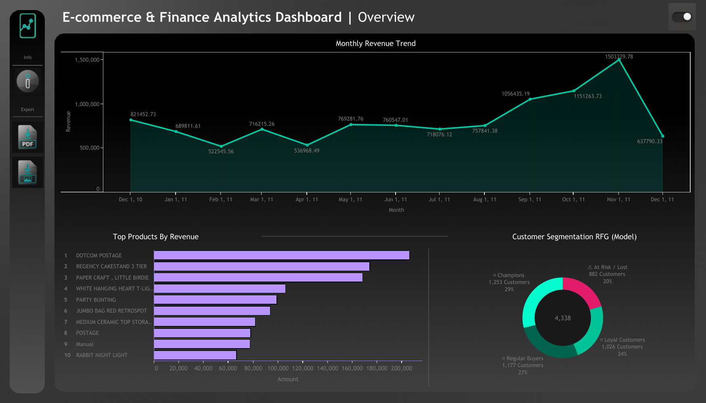
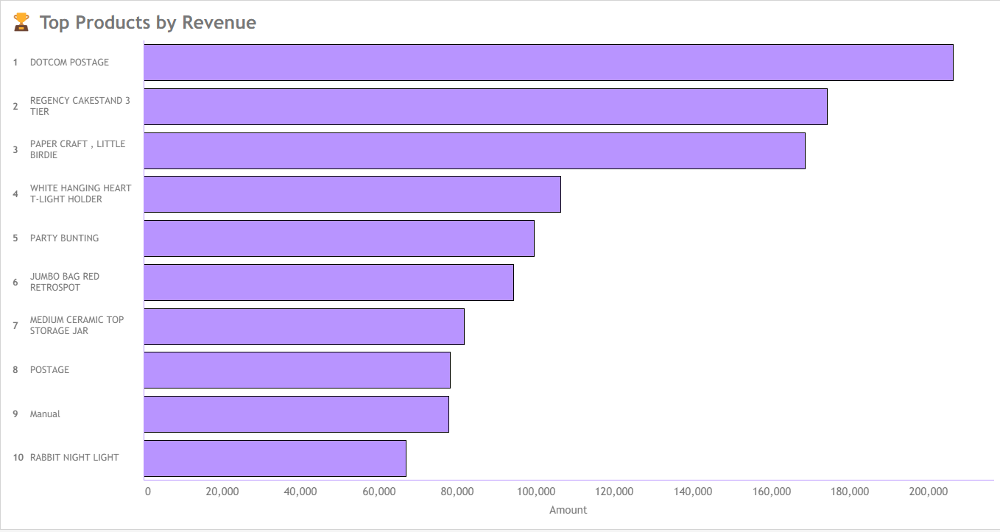
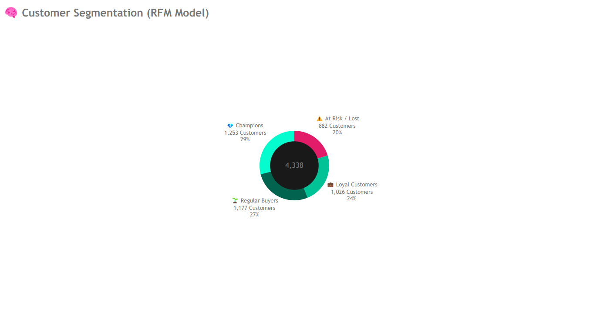

<p align="center">
  
</p>

<h1 align="center">🧾 E-commerce & Finance Analytics Portfolio</h1>

<p align="center">
  <em>SQL-driven data cleaning and analysis uncovering revenue trends, product performance, and seasonal insights from 500K+ e-commerce transactions.</em>
</p>

---

# 🧾 Ecommerce & Finance Analytics Portfolio  

> **End-to-end Data & BI Project** — transforming raw retail data into actionable business intelligence using **SQL, Python, and Tableau**.  
> Cleaned, analyzed, and visualized **500K+ transactions** to uncover revenue trends, top-performing products, and customer behavior patterns.

---

<!-- Badges (centered) -->
<p align="center">
  <a href="https://github.com/HuzeifKhan/Ecommerce-Finance-Analytics-Portfolio/actions/workflows/refresh-report.yml">
    
  </a>
  <a href="https://github.com/HuzeifKhan/Ecommerce-Finance-Analytics-Portfolio/actions/workflows/refresh-report.yml">
    
  </a>
  
  
  
  
</p>

---

<!-- RUN-SUMMARY:START -->
> ✅ Last successful refresh: _pending…_
<!-- RUN-SUMMARY:END -->

---

**Last refreshed (UTC):** see the footer in the latest PDF and the “Last Updated (UTC)” column in  
📊 `04_Excel/KPI_Snapshot.xlsx`

---

## 🚀 Project Overview  

An end-to-end **E-Commerce Finance Analytics** pipeline converting raw transactional data into KPIs and visual insights.  
Built using **SQL + Python + Tableau**, automated via **PowerShell + GitHub Actions**, and updated **nightly** at 03:00 Berlin time.

**Business Impact:**  
- Identified **seasonal peaks (Q4 surge)** and **top-revenue SKUs**  
- Improved **customer segmentation (RFM)** for retention strategy  
- Delivered **automated reporting** for faster decision-making  

---

## ⚙️ Tech Stack  

| Layer | Tools | Purpose |
|:--|:--|:--|
| **Data Cleaning** | MySQL / SQL | Import, clean, aggregate, KPI computation |
| **Analytics** | Python (Pandas · Statsmodels · ReportLab) | RFM modeling, forecasting, PDF/Excel automation |
| **Visualization** | Tableau Public | Interactive KPI dashboard |
| **Automation** | PowerShell · Task Scheduler · GitHub Actions | Daily refresh, logging, CI/CD |
| **Hosting** | GitHub Pages | Live portfolio preview |

---

## 🧹 Data Cleaning Workflow  

**Source:** [Kaggle – E-Commerce Data (Carrie1)](https://www.kaggle.com/datasets/carrie1/ecommerce-data)

1. Loaded 541 K transactions via `LOAD DATA INFILE`  
2. Standardized timestamps (`STR_TO_DATE`)  
3. Removed invalid & duplicate invoices  
4. Filtered anomalies (negative or zero price)  
5. Engineered fields  
   - `LineAmount = Quantity × UnitPrice`  
   - `IsReturn` flag  
   - `InvoiceYear`, `InvoiceMonth`, `InvoiceHour`  
6. Indexed key columns → optimized aggregation  
7. Result: **534 K valid transactions**

---

## 💰 Key Insights  

| Metric | Insight |
|:--|:--|
| **Total Revenue** | € 10,641,558.95 |
| **Valid Transactions** | 534 K |
| **Peak Month** | November 2011 (holiday season) |
| **Top Products** | Gift & Décor items – “DOTCOM POSTAGE”, “REGENCY CAKESTAND 3 TIER” |
| **Customer Segments** | RFM segmentation (Recency · Frequency · Monetary) |

---

## 🎨 Visual Analytics (Tableau Dashboard)  

🔗 **[→ Open Live Dashboard on Tableau Public](https://public.tableau.com/app/profile/huzeif.khan/viz/Book1_17618490659490/E-commerceFinanceAnalyticsDashboard)**  

| Overview | Monthly Revenue | Top 10 Products | Customer Segments |
|:--:|:--:|:--:|:--:|
| [](https://public.tableau.com/app/profile/huzeif.khan/viz/Book1_17618490659490/E-commerceFinanceAnalyticsDashboard) |  |  |  |

> *Neon-cyan cyberpunk theme with clean typography and modular layout.*

---

## 📦 Automated PDF + Excel Reports  

Auto-generated daily using **ReportLab + PowerShell + GitHub Actions**  

📄 `06_Reports/Ecommerce_Finance_Insights_Report.pdf`  
📊 `04_Excel/KPI_Snapshot.xlsx`

**Sections**
- Page 1 → Overview + KPIs + Dashboard link  
- Page 2 → Monthly Revenue & Top Products  
- Page 3 → RFM Segmentation  
- Page 4 → Cohort Retention & CLV analysis (in progress)

---

## ⚙️ Automation Workflow  

### 🔁 Local Automation (PowerShell + Task Scheduler)
- Script `scripts/update_all.ps1` → builds PDF + Excel, commits & pushes  
- Wrapper `scripts/run_scheduled.ps1` → runs nightly, logs output → `/logs/run_*.log`  
- Task Scheduler → **EFA_Portfolio_Nightly_Refresh @ 03:00 Berlin**

### ☁️ Cloud Automation (GitHub Actions)
- Workflow → `.github/workflows/refresh-report.yml`  
- Runs nightly at **02:00 UTC** (≈ **03:00 CET** / **04:00 CEST**)  
- Installs dependencies, rebuilds PDF/Excel, and commits artifacts  
- Status badge above 👆 reflects last run status  

---

## 📁 Project Structure  
```
Ecommerce-Finance-Analytics-Portfolio/
│
├── 01_Data/
│ ├── raw/ # Original Kaggle dataset
│ └── processed/ # Cleaned + analytical datasets (RFM, Cohorts)
│
├── 02_SQL/
│ ├── 01_load_raw.sql # Data import & staging
│ └── 02_cleaning.sql # Cleaning & transformation logic
│
├── 03_Python/
│ ├── ecommerce_analysis.ipynb # Exploratory analysis & RFM modeling
│ └── make_report.py # Automated PDF/Excel generation
│
├── 04_Excel/
│ └── KPI_Snapshot.xlsx
│
├── 05_Tableau/
│ ├── exports/ # Static Tableau PNG exports
│ └── EFA_Dashboard.twbx # Interactive workbook
│
├── 06_Reports/
│ └── Ecommerce_Finance_Insights_Report.pdf
│
├── scripts/
│ ├── update_all.ps1 # Pull → build → commit → push
│ └── run_scheduled.ps1 # Logging wrapper for Task Scheduler
│
├── logs/
│ └── run_YYYY-MM-DD_HH-mm.log # Execution logs
│
├── .github/workflows/
│ └── refresh-report.yml # Nightly CI workflow (02:00 UTC)
│
├── requirements.txt
└── README.md
```

---

## ✨ Highlights  

✅ Full pipeline: SQL → Python → Tableau → PDF → CI/CD  
✅ Cyberpunk visuals + dark neon theme  
✅ **Daily refresh automation** (local + cloud)  
✅ Robust logging & binary-safe Git workflow  
✅ Clean, modular structure ready for enterprise pipelines  

---

## 📈 Quick Links  

- **Live Dashboard:**  
  [View on Tableau Public](https://public.tableau.com/app/profile/huzeif.khan/viz/Book1_17618490659490/E-commerceFinanceAnalyticsDashboard)  
- **Auto-generated PDF Report:**  
  [View Report on GitHub](https://github.com/HuzeifKhan/Ecommerce-Finance-Analytics-Portfolio/blob/main/06_Reports/Ecommerce_Finance_Insights_Report.pdf)  
- **Portfolio Site (GitHub Pages):**  
  [Visit Site](https://huzeifkhan.github.io/Ecommerce-Finance-Analytics-Portfolio/)

---

## 🧩 Next Steps  

- 📈 Add CLV & Churn prediction modules  
- 🧾 Integrate Power BI version for benchmarking  
- 🔁 Simulate dbt / Airflow pipelines for enterprise refresh  

---

## 👨‍💻 Author  

**Huzeif Khan**  
📍 Berlin, Germany  |  💼 Data Analyst / BI Analyst  
🔗 [LinkedIn](https://www.linkedin.com/in/huzeif-khan-651042274/) • [GitHub](https://github.com/HuzeifKhan)
