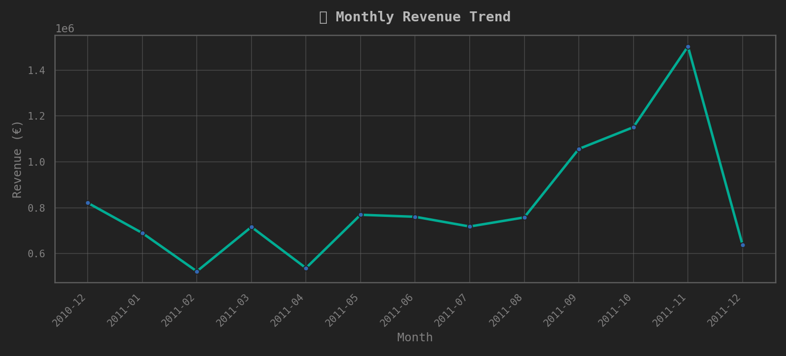
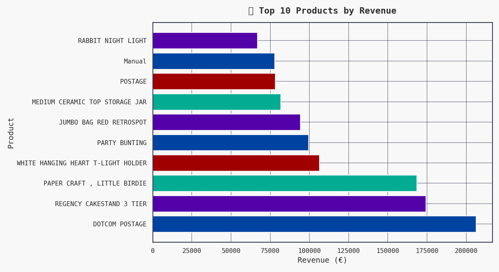
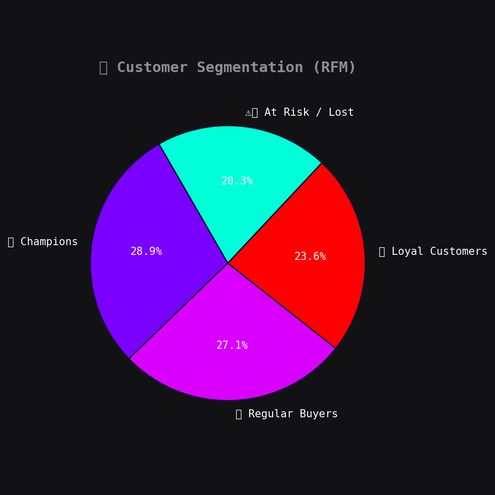

<p align="center">
  
</p>

<h1 align="center">🧾 E-commerce & Finance Analytics Portfolio</h1>

<p align="center">
  <em>SQL-driven data cleaning and analysis uncovering revenue trends, product performance, and seasonal insights from 500K+ e-commerce transactions.</em>
</p>

---

# 🧾 E-Commerce & Finance Analytics Portfolio

> **End-to-End Business Intelligence Project** — from raw retail data to actionable insights using **SQL, Python, and Tableau**.
> Cleaned, transformed, and visualized **500K+ transactions** to uncover revenue patterns, top products, and customer segments — all with a **cyberpunk-inspired aesthetic**.

---

## 📖 Project Overview

This portfolio project showcases a complete **data analytics pipeline** built using **MySQL, Python (Pandas & Matplotlib), and Tableau**.
It demonstrates how structured analytics can turn messy transactional data into **insightful dashboards and automated reports**.

The dataset contains **500K+ transactions** from a **UK-based online retailer (2010–2011)**.
The goal was to transform raw sales data into clean, visual, and interactive business intelligence.

---

## ⚙️ Tech Stack

| Tool                              | Purpose                                        |
| --------------------------------- | ---------------------------------------------- |
| 🧮 **SQL (MySQL)**                | Data cleaning, transformation, KPI computation |
| 🐍 **Python (Pandas, ReportLab)** | EDA, visualization, automated reporting        |
| 📊 **Tableau**                    | Interactive BI dashboard design                |
| 💾 **GitHub**                     | Version control & project documentation        |
| 🧰 **Excel / CSV**                | Validation & data export                       |

---

## 🧹 Data Cleaning Workflow

**Source:** [Kaggle – E-Commerce Data (Carrie1)](https://www.kaggle.com/datasets/carrie1/ecommerce-data)

### Cleaning Steps

1. Imported **541,909 rows** into MySQL via `LOAD DATA INFILE`.
2. Converted date strings using `STR_TO_DATE`.
3. Fixed **2,521 zero-price** and **2 negative-price** rows.
4. Removed duplicates using the `ROW_NUMBER()` window function.
5. Filtered invalid records (`Quantity ≠ 0`, `UnitPrice > 0`).
6. Created analytical fields:

   * `LineAmount = Quantity × UnitPrice`
   * `IsReturn` flag for negative quantities
   * `InvoiceYear`, `InvoiceMonth`, `InvoiceHour`
7. Added indexes for query optimization.
8. Final cleaned dataset: **534,123 valid transactions**.

---

## 💰 Key Business Insights

### 🏷️ Gross Revenue

**€10.64 million** from 534K valid transactions

### 🎯 Top-Selling Products

| Rank | Product                            | Revenue (€) |
| ---- | ---------------------------------- | ----------- |
| 1    | DOTCOM POSTAGE                     | 206,248.77  |
| 2    | REGENCY CAKESTAND 3 TIER           | 174,156.54  |
| 3    | PAPER CRAFT, LITTLE BIRDIE         | 168,469.60  |
| 4    | WHITE HANGING HEART T-LIGHT HOLDER | 106,236.72  |
| 5    | PARTY BUNTING                      | 99,445.23   |
| …    | *(more in Tableau dashboard)*      |             |

🧩 *Observation:* Decorative and household gift items dominate — especially during holiday months.

### 📈 Monthly Revenue Trend

Revenue accelerates steadily from **August → November 2011**, peaking at **€1.5M in November**, likely due to holiday sales.

---

## 🎨 Visual Gallery — Python (Cyberpunk Aesthetic)

|                    Monthly Revenue Trend                    |               Top 10 Products by Revenue              |              Customer Segmentation (RFM)              |
| :---------------------------------------------------------: | :---------------------------------------------------: | :---------------------------------------------------: |
|  |  |  |

> *Custom dark-theme charts with neon highlights for immersive data storytelling.*

---

## 📊 Tableau Dashboard Preview

[](https://public.tableau.com/app/profile/huzeif.khan/viz/Book1_17618490659490/E-commerceFinanceAnalyticsDashboard)
*Click the image to open the full interactive Tableau dashboard on Tableau Public.*

#### 🔍 Individual Views

[](https://public.tableau.com/app/profile/huzeif.khan/viz/Book1_17618490659490/E-commerceFinanceAnalyticsDashboard)
[](https://public.tableau.com/app/profile/huzeif.khan/viz/Book1_17618490659490/E-commerceFinanceAnalyticsDashboard)
[](https://public.tableau.com/app/profile/huzeif.khan/viz/Book1_17618490659490/E-commerceFinanceAnalyticsDashboard)

> Interactive Tableau dashboard integrates the processed KPIs, monthly revenue trends, and RFM segments into a single view.

---

## 🧾 Automated Report Generation (Python)

The project includes a Python script [`make_report.py`](03_Python/make_report.py) that:

* Loads processed datasets (`monthly_revenue`, `top_products`, `customer_rfm_segments`)
* Summarizes KPIs (Total Revenue, Avg Order Value, Customer Count)
* Embeds Tableau exports into a **professionally formatted PDF**

**Output file:**
📄 [`06_Reports/Ecommerce_Finance_Insights_Report.pdf`](06_Reports/Ecommerce_Finance_Insights_Report.pdf)

---

## 📂 Project Structure

```
Ecommerce-Finance-Analytics-Portfolio/
│
├── 01_Data/                      # Raw & processed datasets
│   ├── raw/                      # Original CSV (Kaggle)
│   └── processed/                # Cleaned + RFM outputs
│
├── 02_SQL/                       # SQL cleaning & transformation
│   ├── 01_load_raw.sql
│   └── 02_cleaning.sql
│
├── 03_Analysis/                  # Python notebook & charts
│   ├── ecommerce_analysis.ipynb
│   └── figures/
│
├── 03_Python/                    # Automation scripts
│   └── make_report.py
│
├── 05_Tableau/                   # Tableau dashboard & exports
│   └── exports/                  # PNG visuals for README & PDF
│
├── 06_Reports/                   # Auto-generated PDF reports
│
└── README.md
```

---

## 🧠 Highlights

✅ End-to-end data pipeline — SQL → Python → Tableau
✅ Automated PDF reporting using ReportLab
✅ RFM customer segmentation with quantile scoring
✅ Cyberpunk dark-theme BI design
✅ Ready for extension into predictive analytics

---

## 🚀 Next Steps

* Integrate **Customer Lifetime Value (CLV)** analysis
* Build **automated KPI refresh** using Airflow/dbt
* Extend dashboard with **churn prediction and forecasting**

---

## 👨‍💻 Author

**Huzeif Khan**
MBA in Data Science & Analytics — IU International University, Berlin 🇩🇪
📍 Based in Berlin | 💼 Data Analyst / BI Analyst
📧 [huzeifkhz989@gmail.com](mailto:huzeifkhz989@gmail.com)
🔗 [LinkedIn](https://www.linkedin.com/in/huzeif-khan-651042274/) | [GitHub](https://github.com/HuzeifKhan)

