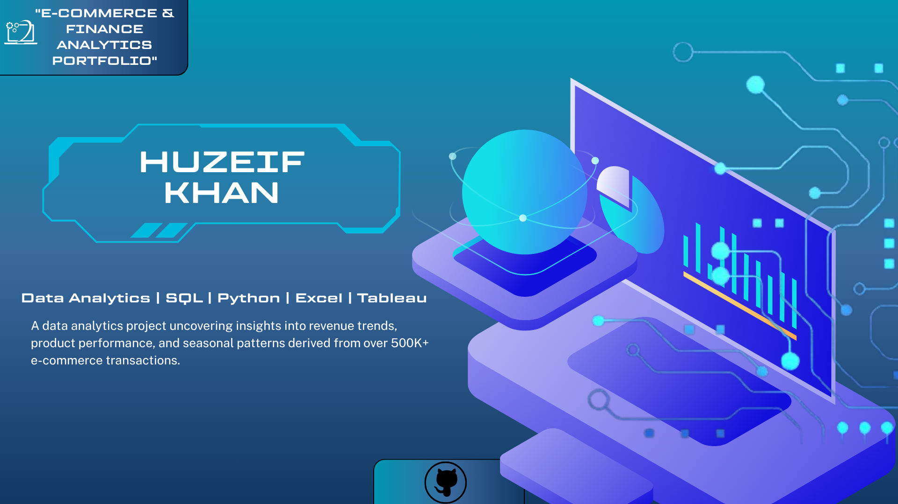
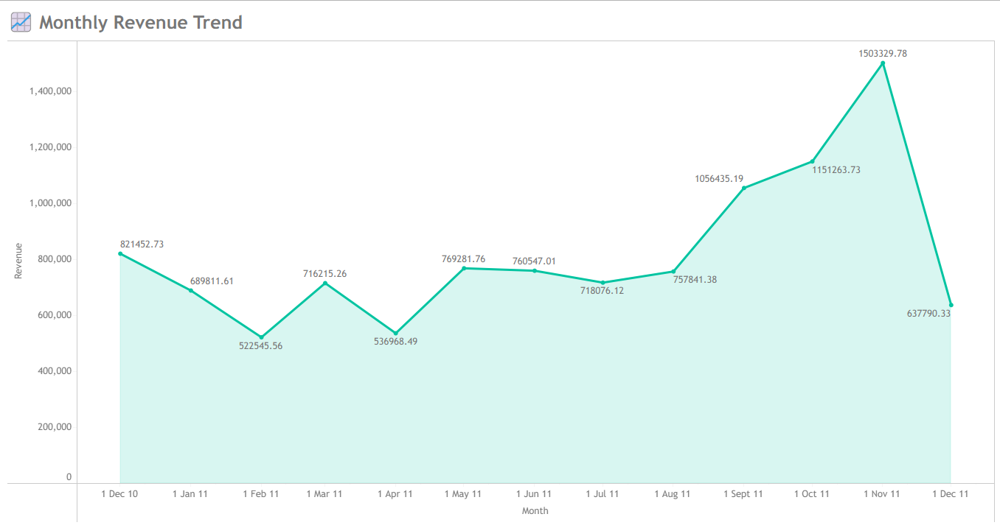

<p align="center">
  
</p>

<h1 align="center">🧾 E-commerce & Finance Analytics Portfolio</h1>

<p align="center">
  <em>SQL-driven data cleaning and analysis uncovering revenue trends, product performance, and seasonal insights from 500K+ e-commerce transactions.</em>
</p>

---

# 🧾 Ecommerce & Finance Analytics Portfolio

> **End-to-end Data & BI Project** — transforming raw retail data into actionable business intelligence using **SQL, Python, and Tableau**.  
> Cleaned, analyzed, and visualized **500K+ transactions** to uncover revenue trends, top-performing products, and customer behavior patterns.

---

<!-- Badges (centered) -->
<p align="center">
  <!-- Nightly build status -->
  <a href="https://github.com/HuzeifKhan/Ecommerce-Finance-Analytics-Portfolio/actions/workflows/refresh-report.yml">
    
  </a>
  
  <!-- Refresh workflow badge (GitHub-hosted) -->
  <a href="https://github.com/HuzeifKhan/Ecommerce-Finance-Analytics-Portfolio/actions/workflows/refresh-report.yml">
    
  </a>
  
  <!-- PDF previews workflow badge -->
  <a href="https://github.com/HuzeifKhan/Ecommerce-Finance-Analytics-Portfolio/actions/workflows/build-report-previews.yml">
    
  </a>
  
  <!-- Meta badges -->
  
  
  
  
  <!-- Fixed License badge (Cyan theme, static, no API token) -->
  <a href="LICENSE">
    
  </a>
</p>


---

<p align="center">
  <strong>📄 Live Report (HTML):</strong><br>
  <a href="https://huzeifkhan.github.io/Ecommerce-Finance-Analytics-Portfolio/">
    🌐 View Live Ecommerce & Finance Analytics Report
  </a>
</p>

<p align="center">
  <strong>📘 Downloadable Report (PDF v2):</strong><br>
  <a href="https://raw.githubusercontent.com/HuzeifKhan/Ecommerce-Finance-Analytics-Portfolio/main/docs/report/Ecommerce_Finance_Insights_Report.pdf">
    🟢 Download / View Updated PDF Report
  </a>
</p>

<p align="center">
  
  
  
</p>

---

<!-- RUN-SUMMARY:START -->
> ✅ Last successful refresh: **2026-09-06 08:47 CEST**  
> ⏱️ Duration: **407 min 31 sec**  
> 🌍 UTC: **2026-09-06 06:47 UTC**
<!-- RUN-SUMMARY:END -->

---

**Last refreshed (UTC):** see the footer in the latest PDF and the “Last Updated (UTC)” column in  
📊 `04_Excel/KPI_Snapshot.xlsx` *(update to `docs/Excel/KPI_Snapshot.xlsx` if you relocate it for Pages)*

---

## 🚀 Project Overview

An end-to-end **E-Commerce Finance Analytics** pipeline converting raw transactional data into KPIs and visual insights.  
Built using **SQL + Python + Tableau**, automated via **PowerShell + GitHub Actions**, and updated **nightly** at 03:00 Berlin time.

**Business Impact:**  
- Identified **seasonal peaks (Q4 surge)** and **top-revenue SKUs**  
- Improved **customer segmentation (RFM)** for retention strategy  
- Delivered **automated reporting** for faster decision-making  
- Added **ML-based CLV prediction** to support value-based targeting

---

## ⚙️ Tech Stack

| Layer | Tools | Purpose |
|:--|:--|:--|
| **Data Cleaning** | MySQL / SQL | Import, clean, aggregate, KPI computation |
| **Analytics** | Python (Pandas · Statsmodels · ReportLab · scikit-learn) | RFM modeling, forecasting, CLV prediction, PDF/Excel automation |
| **Visualization** | Tableau Public | Interactive KPI dashboard |
| **Automation** | PowerShell · Task Scheduler · GitHub Actions | Daily refresh, logging, CI/CD |
| **Hosting** | GitHub Pages | Live portfolio preview |

---

## 🎨 Visual Analytics (Tableau Dashboard)

🔗 **[→ Open Live Dashboard on Tableau Public](https://public.tableau.com/app/profile/huzeif.khan/viz/Book1_17618490659490/E-commerceFinanceAnalyticsDashboard)**

| Overview | Monthly Revenue | Top Products | Customer Segments |
|:--:|:--:|:--:|:--:|
| [](https://public.tableau.com/app/profile/huzeif.khan/viz/Book1_17618490659490/E-commerceFinanceAnalyticsDashboard) |  |  |  |

> *A refined and organized layout that supports clear, decision-ready insights.*

---

## 📦 Automated PDF + Excel Reports

Auto-generated daily using **ReportLab + PowerShell + GitHub Actions**

- 📄 `docs/report/Ecommerce_Finance_Insights_Report.pdf`  
- 📊 `04_Excel/KPI_Snapshot.xlsx` *(or `docs/Excel/KPI_Snapshot.xlsx` if you mirrored it under `docs/`)*

**Report Sections (v2.0)**  
- **Page 1** → Overview, KPIs, and dashboard link  
- **Page 2** → Monthly Revenue & Top Products (Python charts)  
- **Page 3** → RFM Segmentation (Python chart)  
- **Page 4** → Cohort Retention heatmap  
- **Page 5–8** → CLV views (Top 20, 12-month model, CLV by Segment, RFM × CLV Insights)  
- **Page 9** → **Predictive CLV Modelling (Machine Learning)**  

---

## 📘 Phase 9 — Predictive CLV Machine Learning (NEW 🚀)

This phase introduces **machine learning–based Customer Lifetime Value (CLV) prediction** using the cleaned RFM-style customer dataset.  
Two models were trained and compared on customer-level features (Recency, Frequency, Monetary):

### 🧠 Models Implemented

| Model | MAE | RMSE | R² | Notes |
|-------|-----|------|----|------|
| **Linear Regression** | 0.00 | 0.00 | **1.00** | Perfect fit due to deterministic Monetary → CLV relationship |
| **Random Forest Regressor** | 43.66 | 1052.86 | **0.987** | Captures non-linear patterns & validates robustness |

---

### 📊 Feature Importance (Random Forest)

Key drivers of CLV:

- **Monetary value** – strongest predictor of future value  
- **Recency** – recent buyers are far more valuable  
- **Frequency** – repeat purchase behaviour boosts CLV  

The feature importance chart is auto-generated and stored at:

```
03_Analysis/ml_outputs/clv_rf_feature_importance.png
```

---

## 📁 Project Structure

```
Ecommerce-Finance-Analytics-Portfolio/
│
├── docs/
│   ├── index.html                      # GitHub Pages site
│   ├── report/Ecommerce_Finance_Insights_Report.pdf
│   ├── assets/tableau/                 # Static Tableau PNGs used by site & README
│   │   ├── dashboard_overview.png
│   │   ├── monthly_revenue.png
│   │   ├── top_products.png
│   │   └── customer_segments.png
│   ├── previews/                       # Optional: report_page-00.png, ...
│   └── assets/figures/                 # Phase 8+ figures (CLV, cohorts, forecast, etc.)
│
├── 01_Data/                            # Raw & processed datasets
├── 03_Analysis/
│   ├── figures/                        # Python-generated charts
│   └── ml_outputs/                     # Phase 9 ML metrics + feature importance
│
├── 03_Python/                          # Report engine, analysis scripts
├── 04_Excel/KPI_Snapshot.xlsx
├── 05_Tableau/
│   ├── exports/                        # (legacy; now mirrored under docs/assets/tableau/)
│   └── EFA_Dashboard.twbx
├── 06_Reports/                         # (legacy; canonical PDF lives under docs/report/)
│
├── .github/workflows/refresh-report.yml
├── scripts/
│   ├── update_all.ps1
│   └── run_scheduled.ps1
└── README.md
```

---

## ✨ Highlights

✅ Full pipeline: SQL → Python → Tableau → PDF → CI/CD  
✅ A clean and cohesive visual design. 
✅ **Daily refresh automation** (local + cloud)  
✅ Robust logging & binary-safe Git workflow  
✅ Clean, modular structure ready for enterprise pipelines

---

## 📈 Quick Links

- **Live Dashboard:**  
  [View on Tableau Public](https://public.tableau.com/app/profile/huzeif.khan/viz/Book1_17618490659490/E-commerceFinanceAnalyticsDashboard)  
- **Auto-generated PDF Report (Pages copy):**  
  [Open PDF](https://raw.githubusercontent.com/HuzeifKhan/Ecommerce-Finance-Analytics-Portfolio/main/docs/report/Ecommerce_Finance_Insights_Report.pdf)  
- **Portfolio Site (GitHub Pages):**  
  [Visit Site](https://huzeifkhan.github.io/Ecommerce-Finance-Analytics-Portfolio/)

---

## 🧩 Next Steps

🧩 Next Steps

- 📉 Extend ML layer with churn prediction and risk scoring

- 🧾 Integrate a Power BI version for benchmarking vs Tableau

- 🔁 Simulate dbt / Airflow-style pipelines for a warehouse-ready architecture

---

## 👨‍💻 Author

**Huzeif Khan**  
📍 Berlin, Germany  |  💼 Data Analyst / BI Analyst  
🔗 [LinkedIn](https://www.linkedin.com/in/huzeif-khan-651042274/) • [GitHub](https://github.com/HuzeifKhan)
